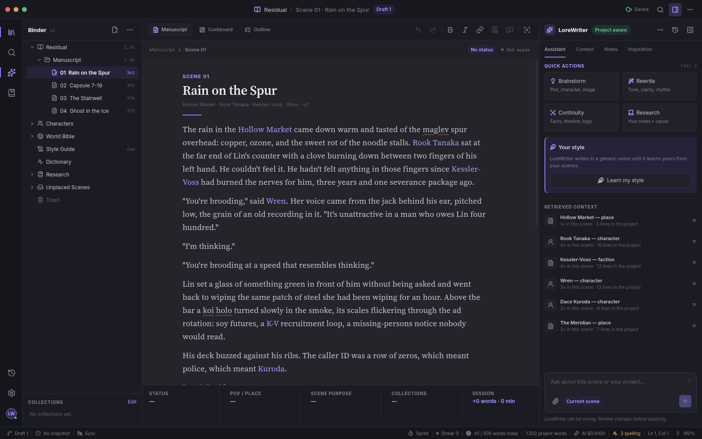

# LoreWriter

A fiction-writing app for your desktop and your terminal. Your novel is a folder
of plain Markdown files; characters and places are notes that link both ways; and
AI helps you keep the story consistent, but it only ever **suggests** — it never
changes your prose unless you accept the change.



LoreWriter runs on Windows, macOS and Linux. The desktop app (`lorewrite-gui`)
and the terminal app (`lorewrite`) open the same projects, so you can use either,
or both.

## Why

- **Your novel is just files.** A project is a folder of Markdown. It is
  greppable, works with git, and opens in Obsidian or any editor. There is no
  database to lose and no lock-in.
- **A living story bible.** Characters and places have free-text notes with
  aliases. Select a name once and make a note; from then on every mention is
  coloured, jumpable and counted in backlinks. No brackets needed (`[[Name]]`
  links still work).
- **AI that suggests, never edits.** Every AI result is a proposal you accept or
  reject. Nothing is applied behind your back, and unaccepted AI text is never
  treated as canon.
- **Optional AI, bring your own key.** Without a key everything but the AI
  features works, offline.

## Features

**Writing**
- Markdown editor with autosave, word counts, writer/focus mode and an offline
  spell check (spelling only; your characters' names are never flagged; personal
  and project dictionaries are plain text files).
- Desktop: live-preview editor (link brackets and AI markers hidden), binder,
  corkboard and outline views with drag-to-reorder, and an inspector for scene
  details. Terminal: sidebar, command palette (`ctrl+p`) and keyboard-first
  editing.
- On Omarchy (Linux) the terminal app follows the system theme; elsewhere it uses
  Textual's built-in themes.
- Session stats, a daily word target with a streak, and focus sprints. These
  numbers stay on your machine, never in the project.

**Organising the book**
- Parts (folders), scenes, an *Unplaced* shelf for scenes you wrote but kept out
  of the book, and a Trash: deleting always moves to `.trash/`.
- Collections ("Needs continuity pass", "Mara's arc"), scene details (POV, place,
  status, word target) as YAML frontmatter, comments on passages (kept beside the
  scene, never in the prose), research notes, and snapshots with a word-by-word
  comparison and restore.
- Optional git sync that runs only when you click: commit, push (never forced,
  asks first) and init. Without git installed, nothing shows.

**AI, always review-gated** (OpenRouter)
- *Alias finder*: finds other ways your prose refers to known characters ("the
  old smith") and offers them as aliases.
- *Continuity check* and *story-bible updates*: flags contradictions with canon.
- *Style guide*: learns your voice from your own prose into an editable
  `style.md`; then draft at the cursor, expand a `{{expand: note}}` marker or
  rewrite a selection. Results are pending drafts you accept or reject.
- *Assistant chat* with attachments (scenes, notes, research, your comments),
  *Research* questions answered from your own notes, *Brainstorm*, and
  *Inspiration images* for reference while you write.

**Export**
- A typeset PDF book, a double-spaced manuscript-review PDF with line numbers, a
  plain proof PDF, Markdown, and DOCX / EPUB / LaTeX through pandoc. Files go to
  `exports/` and are never overwritten.

## Install

| Way | Status |
|---|---|
| Download a release (Windows / macOS / Linux) | coming |
| `pipx install lorewriter` (PyPI) | coming |
| From source | below |

### From source

You need **Python 3.11+**. To build the desktop UI you also need **Node 20+**.
The terminal app needs neither Node nor a graphical environment.

**Linux** — the desktop app uses the system WebKitGTK, so install the system
packages and create the virtual environment with `--system-site-packages`:

```bash
# Debian / Ubuntu
sudo apt install python3-gi gir1.2-webkit2-4.1
# Fedora
sudo dnf install python3-gobject webkit2gtk4.1
# Arch
sudo pacman -S python-gobject webkit2gtk-4.1
```

**Windows** — the desktop app uses the WebView2 runtime, which is preinstalled on
Windows 10 and 11. **macOS** needs nothing extra.

```bash
git clone https://github.com/anonymousacademe/lorewriter
cd lorewriter

python3 -m venv .venv                      # Linux: add --system-site-packages
source .venv/bin/activate                  # Windows: .venv\Scripts\activate
pip install -e ".[all]"                    # or: pip install -r requirements.txt && pip install -e .

(cd gui && npm ci && npm run build)        # builds the desktop UI into the package

lorewrite-gui                              # the desktop app
lorewrite                                  # the terminal app
```

`pip install -e .` alone gives the terminal app. Extras: `gui` (pywebview), `export`
(PDF export), `all` (both). **pandoc** is optional and only needed for DOCX, EPUB and
LaTeX export (the options are greyed out without it): `apt install pandoc`,
`dnf install pandoc`, `pacman -S pandoc`, `brew install pandoc`, or `winget install pandoc`.

## Quick start

Open a copy of the bundled example, a short cyberpunk story with a story bible
(see [examples/README.md](examples/README.md)):

```bash
cp -r examples/residual ~/residual         # Windows: xcopy /E /I examples\residual %USERPROFILE%\residual
lorewrite-gui --project ~/residual         # or: lorewrite --project ~/residual
```

Or start your own: both apps open on a launch screen with your recent projects,
*Open folder* and *New project* (default location `~/novels/<title>`).

Terminal keys (the desktop app shows its own in the UI; `f1` lists them all):

| Key | Action |
|---|---|
| `ctrl+p` | command palette — everything lives here |
| `ctrl+n` | new scene |
| `ctrl+j` | open the note under the cursor; with a name selected, create it |
| `ctrl+l` | AI: find aliases in this scene |
| `ctrl+g` | AI write: draft at cursor / expand a marker / rewrite the selection |
| `f7` / `f8` | accept / reject the AI draft under the cursor |
| `f6` | spell check: fix the next misspelled word |
| `alt+←/→` | previous / next scene |
| `f11` | writer mode |

## AI setup (optional)

AI features use [OpenRouter](https://openrouter.ai) with your own key. Either set
the `OPENROUTER_API_KEY` environment variable, or enter the key in the app
(Settings, or *Action · Set OpenRouter API key* in the terminal palette); it is
stored in your operating system's keyring, never in a project file.

Models are chosen per role in Settings (type a slug, or pick from the live catalogue),
or per project in `project.toml`, where the project wins:

| Role | Used for | Default |
|---|---|---|
| fast | alias finding | `google/gemini-2.5-flash` |
| strong | continuity checks, story-bible updates | `anthropic/claude-sonnet-4.5` |
| writing | drafting, rewrites, style guide | `anthropic/claude-sonnet-4.5` |
| image | inspiration images | `google/gemini-3.1-flash-lite-image` |

```toml
[ai]
fast_model = "google/gemini-2.5-flash"
strong_model = "anthropic/claude-sonnet-4.5"
writing_model = "anthropic/claude-sonnet-4.5"
```

**Costs.** You pay OpenRouter's per-model prices directly; LoreWriter adds nothing.
The status bar shows the running total for the session (for example `AI $0.0123`)
and each AI call reports its own cost. An inspiration image costs about $0.03 with
the default image model, and images are only ever generated when you click.

## Your files

```
my-novel/
├── project.toml          # title, [editor] and [ai] settings
├── manuscript/
│   ├── 01-opening.md     # scenes, numbered; reorder in the app
│   ├── 03-the-recall/    # a folder is a part (title in _part.md)
│   └── _unplaced/        # written, but not in the book
├── entities/
│   ├── characters/elara-vance.md   # free-text note + YAML frontmatter
│   └── places/thornwick.md         #   (name, type, aliases)
├── research/             # reference notes (plain Markdown, any subfolders)
├── inspiration/          # pictures, each with a .md sidecar (prompt, notes)
├── exports/              # files you exported
├── style.md              # your learned style guide (editable)
├── dictionary.txt        # words to accept in spell check
└── .trash/ .drafts/ .snapshots/ .comments/ .assistant/   # app data, plain files
```

A SQLite index under `.lorewrite/` powers backlinks. It is a rebuildable cache
(`f9` in the terminal): your files are always the truth.

## Privacy

- Your project never leaves your machine unless you use an AI feature, push with
  git, or copy it yourself. LoreWriter has no accounts and no telemetry.
- AI calls go to OpenRouter (and from there to the model you chose) **only when
  you trigger them**. What is sent depends on the feature: the alias finder and the
  continuity check send the scene you have open and the relevant character and place
  notes; drafting also sends your style guide and the text around the cursor; the
  assistant sends your question, the context it retrieved, and anything you attached;
  *Describe this scene* sends the passage around the cursor, and image generation
  sends only the prompt you approved.
- Never sent: scenes you did not open or attach, your comments (unless you attach
  them), unaccepted AI text as if it were your prose, scene details frontmatter as
  text, and your spelling dictionaries. Spell check, stats and search are fully local.
- The only other network request is the public OpenRouter model catalogue, fetched
  when you open a model picker.

## Documentation

- **User's Guide** (PDF with screenshots): attached to each
  [GitHub Release](https://github.com/anonymousacademe/lorewriter/releases).
  Its sources are in [docs/user-guide/](docs/user-guide/).
- [SPEC.md](SPEC.md): the design document and roadmap.
- [examples/README.md](examples/README.md): things to try in the sample project.
- [CONTRIBUTING.md](CONTRIBUTING.md) and [AGENTS.md](AGENTS.md): working on the code.

## Development

```bash
pip install -r requirements-dev.txt && pip install -e .
python -m pytest                          # pure core units, headless TUI, GUI backend
(cd gui && npm ci && npm run lint && npm test && npm run build)
python -m lorewrite.gui.devserver --project COPY --mock-ai   # the UI in any browser, canned AI
```

The desktop UI is built with Vite into `src/lorewrite/gui/web/` (git-ignored, shipped
as package data). Architecture notes: [gui/README.md](gui/README.md).

This project was built with the help of AI coding assistants, which wrote much of
the code under the author's direction.

## License

[MIT](LICENSE) © 2026 Mishkin. Bundled export fonts: Noto Serif (SIL OFL 1.1) and
Liberation Mono (SIL OFL 1.1); their licences are in
`src/lorewrite/core/export/fonts/`.
